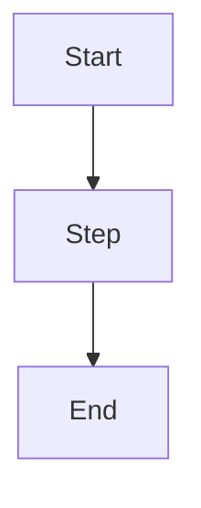

# Obsidian Vault Assistant

Read and write Markdown notes in the user's Obsidian vault using standard file system operations.
Obsidian notes are plain `.md` files with optional YAML frontmatter and Obsidian-specific syntax.

---

## Prerequisites

The vault path must be set in CLAUDE.md as `OBSIDIAN_VAULT`. Example:

```
OBSIDIAN_VAULT=/Users/you/Documents/Obsidian
```

If not set, tell the user:
> Add this to your `~/.claude/CLAUDE.md`:
> ```
> OBSIDIAN_VAULT=/path/to/your/vault
> ```

---

## Vault Layout Convention

Use this layout unless the vault already has its own structure (check first):

```
00 Inbox/          # quick capture, unprocessed notes
10 Notes/          # evergreen, standalone notes
20 Projects/       # project-specific docs, one subdirectory per project
90 Attachments/    # images, PDFs, diagrams
99 Meta/           # templates, MOC pages, glossary
```

When in doubt, put new notes in `10 Notes/` unless the user specifies otherwise.

---

## Core Operations

### Read a note

```bash
cat "$OBSIDIAN_VAULT/path/to/Note Title.md"
```

### List notes in a folder

```bash
ls "$OBSIDIAN_VAULT/10 Notes/"
find "$OBSIDIAN_VAULT" -name "*.md" | head -50
```

### Search for content

```bash
grep -r "search term" "$OBSIDIAN_VAULT" --include="*.md" -l
grep -r "search term" "$OBSIDIAN_VAULT" --include="*.md" -n
```

### Create or update a note

Use the Write or Edit tool with absolute path: `$OBSIDIAN_VAULT/Folder/Note Title.md`

- Filename = note title (Obsidian uses filenames as titles)
- Use spaces, not hyphens, in filenames (Obsidian convention)
- Extension is always `.md`

### List all notes (recursive)

```bash
find "$OBSIDIAN_VAULT" -name "*.md" -not -path "*/.obsidian/*" | sort
```

---

## Obsidian Syntax Reference

### Wikilinks (always prefer over markdown links)

```md
[[Note Title]]                    # link to note
[[Note Title|display text]]       # link with alias
[[Note Title#Heading]]            # link to section
[[Note Title#^block-id]]          # link to block
![[Note Title]]                   # embed/transclude note
![[Note Title#Section]]           # embed section
![[image.png]]                    # embed image
```

### Properties (YAML frontmatter)

Always place at the very top of the file:

```yaml
---
type: note          # note | doc | adr | howto | meeting | spec | moc
status: draft       # draft | active | deprecated | archived
tags: [tag1, tag2]
project: Project Name
created: 2026-02-20
owner: zakhar
---
```

### Callouts

```md
> [!note]
> Useful info.

> [!tip]
> A practical tip.

> [!warning]
> Something risky or important.

> [!info]
> Background context.

> [!todo]
> Action item.
```

### Tasks

```md
- [ ] pending task
- [x] completed task
```

### Tags

```md
#draft #howto #project-x
```

---

## Standard Note Templates

### Evergreen Note (`10 Notes/`)

```md
---
type: note
status: draft
tags: []
created: YYYY-MM-DD
---

# Title

## Overview

## Details

## References
- [[Related Note]]
```

### How-To / Doc (`20 Projects/` or `10 Notes/`)

```md
---
type: howto
status: draft
project: Project Name
tags: [howto]
created: YYYY-MM-DD
---

# How to: Title

> [!info]
> **Purpose:**
> **Audience:**

## Prerequisites

## Steps

1. Step one
2. Step two

## Troubleshooting

> [!warning]
> Common pitfall here.

## References
- [[Related Doc]]
```

### ADR (Architecture Decision Record)

```md
---
type: adr
status: active
project: Project Name
tags: [adr]
created: YYYY-MM-DD
---

# ADR-NNNN: Decision Title

## Context

What is the situation that requires a decision?

## Decision

What did we decide?

## Consequences

What are the trade-offs and outcomes?

## Alternatives Considered

- Option A: ...
- Option B: ...
```

### MOC (Map of Content / Index)

```md
---
type: moc
status: active
tags: [index]
created: YYYY-MM-DD
---

# 📚 Project / Area Name

> [!info]
> Index note for [[Project Name]]. Start here.

## Overview

Brief description of the area.

## Core Docs

- [[Getting Started]]
- [[Architecture Overview]]

## How-Tos

- [[How to: Deploy]]
- [[How to: Debug]]

## ADRs

- [[ADR-0001 - Decision Title]]

## References
```

---

## Workflow

### When creating a note

1. Check if the vault path is known (from CLAUDE.md)
2. Check if a similar note already exists (`grep -r` or `find`)
3. If found, offer to update it instead of creating a duplicate
4. Choose the right folder based on note type
5. Apply the appropriate template
6. Fill in the properties (type, status, created date, tags)
7. Write the note with Write tool
8. If there's a relevant MOC/index page, offer to add a link to it

### When searching notes

1. Use `grep -r` for content search, `find` for filename search
2. Show the file path, relevant line, and context
3. Offer to open/show the full note

### When updating a note

1. Read the existing note first
2. Preserve the frontmatter properties
3. Update the `status` if the note is transitioning (e.g. draft → active)
4. Use Edit tool for targeted changes, Write tool for full rewrites

### When the user asks to "document X"

1. Decide: is this a how-to, a reference note, an ADR, or an evergreen note?
2. Ask the user if unclear
3. Create in the right folder with the right template
4. Link from the relevant MOC page if one exists

---

## Formatting Guidelines

- Use `[[wikilinks]]` instead of `[markdown links](file.md)` for internal notes
- Keep headings clean (they become the Outline sidebar in Obsidian)
- Use callouts for tips, warnings, and TL;DR sections
- Put "References" section at the bottom linking related notes
- Use Mermaid code blocks for diagrams:

````md

````

- Avoid deep folder nesting — prefer links over folders for relationships

---

## Health Checks

If the user asks to audit or organize their vault:

```bash
# Find orphan notes (no backlinks) — approximate: notes not referenced in other notes
find "$OBSIDIAN_VAULT" -name "*.md" -not -path "*/.obsidian/*" | while read f; do
  title=$(basename "$f" .md)
  if ! grep -qr "\[\[$title" "$OBSIDIAN_VAULT" --include="*.md"; then
    echo "ORPHAN: $f"
  fi
done

# Find notes with status: draft
grep -rl "status: draft" "$OBSIDIAN_VAULT" --include="*.md"

# Find notes without frontmatter
find "$OBSIDIAN_VAULT" -name "*.md" -not -path "*/.obsidian/*" | while read f; do
  if ! head -1 "$f" | grep -q "^---"; then
    echo "NO FRONTMATTER: $f"
  fi
done
```

---

## Error Handling

| Situation | Action |
|-----------|--------|
| `OBSIDIAN_VAULT` not set | Tell user to add it to `~/.claude/CLAUDE.md` |
| Note already exists | Read it, ask if they want to update or create new |
| Folder doesn't exist | Create it with `mkdir -p` before writing the note |
| No MOC for the area | Offer to create one |
